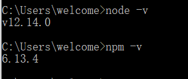
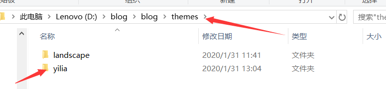
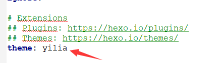

# Windows下搭建，部署在GitHub上的hexo框架blog

## 一、配置环境

1、安装Node.js 官网https://nodejs.org/en

由于hexo是用js开发的所以需要一些依赖包。

安装完成可以在命令行中输入如下，来检查Node.js安装否成功。

```
node -v
npm -v 
```



注：*NPM*的全称是Node Package Manager，是一个NodeJS包管理和分发工具，已经成为了非官方的发布Node模块的标准。 

2、安装Git 官网 https://git-scm.com

Git 不仅仅是个版本控制系统，它也是个内容管理系统(CMS)，工作管理系统等。 

在这里的主要用处是从GitHub等开源网站上下载主题模板等。

## 二、安装并初始化hexo

1、安装hexo

因为npm安装插件是从国外服务器下载，受网络影响大，可能出现异常，如果npm的服务器在中国就好了，所以我们乐于分享的淘宝团队干了这事。来自官网：“这是一个完整 npmjs.org 镜像，你可以用此代替官方版本(只读)，同步频率目前为 10分钟 一次以保证尽量与官方服务同步。” 

```
 $ npm install cnpm -g --registry=https://registry.npm.taobao.org 
```

```
 $ cnmp install -g hexo   $ cnpm install hexo-deployer-git --save
```

2、初始化hexo

首先在硬盘的任何一个地方创建一个叫blog的空文件夹后执行一下命令

```
$ cd  [路径是：blog的空文件夹]
$ hexo init
$ npm install  #安装相关依赖
```

3、生成框架自带的主题Demo

```
 $ hexo generate #生成静态页面
 $ hexo server #启动本地预览服务
```

然后用浏览器访问<http://localhost:4000/> 

4、主题的更改

hexo3.0使用的默认主题是landscape, 我们可以自行下载主题到theme目录下 

```
 $ npm install <plugin-name> --save
 $ git clone <repository> themes/<theme-name> #用于从GitHub上下载开源的主题
```

无论是插件还是主题在安装后都需要在根目录下_config.yml中修改plugins和theme的值以启用他们。 





5、 发布到github上

配置根目录 _config.yml 的参数（位置在配置文件的最下面）


注：所有参数的：后有一个空格。repo的值是你的repository的名字，一定要有.git

相关属性设置注释: 

```javascript
# Hexo Configuration
## Docs: http://hexo.io/docs/configuration.html
## Source: https://github.com/hexojs/hexo/

# Site  这下面的几项配置都很简单，你看我的博客就知道分别是什么意思
title: 常兴驿站 #博客名
subtitle: Goals determine what you are going to be  #副标题
description: Goals determine what you are going to be #用于搜索，没有直观表现
author: changxing   #作者
language: zh-CN #语言
timezone:   #时区，此处不填写，hexo会以你目前电脑的时区为默认值

# URL   暂不配置，使用默认值
## If your site is put in a subdirectory, set url as 'http://yoursite.com/child' and root as '/child/'
url: http://yoursite.com
root: /
permalink: :year/:month/:day/:title/
permalink_defaults:

# Directory     暂不配置，使用默认值
source_dir: source
public_dir: public
tag_dir: tags
archive_dir: archives
category_dir: categories
code_dir: downloads/code
i18n_dir: :lang
skip_render:

# Writing   文章布局等，使用默认值
new_post_name: :title.md # File name of new posts
default_layout: post
titlecase: false # Transform title into titlecase
external_link: true # Open external links in new tab
filename_case: 0
render_drafts: false
post_asset_folder: false
relative_link: false
future: true
highlight:
  enable: true
  line_number: true
  tab_replace:

# Category & Tag    暂不配置，使用默认值
default_category: uncategorized
category_map:
tag_map:

# Date / Time format    时间格式，使用默认值
## Hexo uses Moment.js to parse and display date
## You can customize the date format as defined in
## http://momentjs.com/docs/#/displaying/format/
date_format: YYYY-MM-DD
time_format: HH:mm:ss

# Pagination    
## Set per_page to 0 to disable pagination
per_page: 10    #每页显示的文章数，0表示不分页
pagination_dir: page

# Extensions    插件配置，暂时不配置
## Plugins: http://hexo.io/plugins/
## Themes: http://hexo.io/themes/
plugins:
- hexo-generator-feed
theme: yilia    #使用的主题

feed:   #之后配置rss会用，此处先不配置这个
  type: atom
  path: atom.xml
  limit: 20  

# Deployment    用于部署到github，之前已经配置过
## Docs: http://hexo.io/docs/deployment.html

deploy: 
  type: git
  repository: https://your.git
  branch: master

```

执行命令上传到云端github上 :

```
$ hexo clean
$ hexo deploy
```

部署是需要你输入GitHub的用户名和密码

注：如果没有配置好git，会出现邮箱和用户名问题，这时需要执行

```javascript

git config --global user.name 'username' # 更改用户名
git config --global user.email 'email # 更改邮箱

```

这样一个简单的静态博客框架就搭建完了。

之后还需要根据自己的喜好更换主题以及修改样式添加功能等。

### 介绍几个hexo常用的命令,#后面为注释。

```javascript
$ hexo g #完整命令为hexo generate,用于生成静态文件
$ hexo s #完整命令为hexo server,用于启动服务器，主要用来本地预览
$ hexo d #完整命令为hexo deploy,用于将本地文件发布到github上
$ hexo n #完整命令为hexo new,用于新建一篇文章，创建的文章放在blog\source\_posts目录下，所以可以把写好的md文件放在此目录下
```

