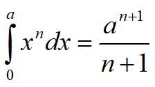
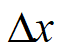
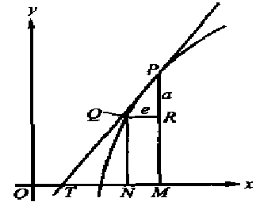

# 微积分代表近代数学的开源

数学中的转折点是笛卡尔的变数，有了变数，运动进入了数学，有了变数，辩证法进入了数学，有了变数，微分和积分就立刻变成必要的了，而它们也就立刻产生，并且是由牛顿和莱布尼茨大体上完成的。

初等数学，即常量数学，是形式逻辑的范围内活动的，至少总的来说是这样的，而变数数学——其中最重要的部分就是微积分——本质上不外是辩证法在数学方面的运用。

微积分的创立是人类精神的最高胜利。——恩格斯

数学中的每一步真正的进展都与更有利的工具和更简单的方法的发现密切联系着，这些工具和方法同时会有助于理解已有的理论并把陈旧的，复杂的东西抛到一边。数学科学这种发展的特点是根深蒂固的。——希尔伯特

主要内容

## 早期微积分思想

### 积分起源

古代的面积与体积的计算：无限小的过程求和

- 德谟克利特的原子论
- 欧多克斯的穷竭法
- 阿基米德的平衡法
- 祖堆原理

### 微分起源

- 古希腊求切线
- 阿基米德螺线的切线——切触线
- 中国古代天文中天体的极大极小问题——有限查分

## 微积分近代起源

##### 微积分的酝酿，主要是17世纪上半叶

- 1609年，望远镜的发明
- 1619年，开普勒行星三大定律
- 1638年，伽利略的动力学——自然科学数学化
- 17世纪上半叶，随着函数观念的建立和对机械运动规律的探索，数学家们形成了4类主要的问题，瞬时变化率，切线问题，函数极值，几何求积。

##### 积分问题——开普勒的酒桶问题（1571-1630）

- 基本思想：用无数多个同维无限小来求曲面的面积和体积
- 求得体积
- 圆锥
- 圆环的体积

##### 积分问题——卡瓦列里原理（1598-1697）与祖冲之原理一样

- 卡瓦列里原理
- 积分关系法：
- 对托里切利，费马，惠更斯，沃利斯，巴罗等都有影响。

##### 积分问题——沃利斯的无穷计算（1616-1703）

- 沃利斯是牛顿和莱布尼茨之前将**分析方法**引入微积分最突出的数学家
- 用算数（“分析”发展积分法）

1. 推广会幂函数的积分公式
2. pl的无穷乘积形式

- 引导了牛顿的流速学。

##### 微分问题——笛卡尔的“圆法”

- 记载于《几何学》
- 求曲线某一点的切线（确定法线再确定切线），这本质上是一种代数方法。
- 牛顿是以笛卡尔圆法为起跑点而研究微积分的。
- 胡德法则为“圆法”计算重根提供了机械算法。

##### 微分问题——费马求极大值和极小值方法

- 1637年的手稿中，提出了求曲线的极大值极小值的代数方法。
- 利用增量的方法来求极值。与今天利用导数为0，求极值点的方法一致。

​           按费马的方法。设函数f(x)在点a处取极值，费弓用“a+e”代替原来的未知量a，并使f(a+e)与f(a)逼近,即：     f(a+e)～f(a) 这里所提到的“e”就是后来微积分学当中的“      ”

- 他的方法可以推广到其他问题，比如求切线。
- 兰伯特认为费马是微积分的发明人。
- 牛顿也说从中获得了启示。

##### 微分问题——巴罗的“微分三角形” （1630-1677）牛顿的老师

- 巴罗用微分三角形求曲线的切线，用微分三角形表达增量
- 微分三角形，本质的思想就是“化曲为直”

- 有人认为，巴罗已经认识到微分法（求切线）为积分法（求积法）的逆运算，因此被认为是微积分的发明人。

## 牛顿的流速法

## 莱布尼茨的微积分

## 微积分创立的意义